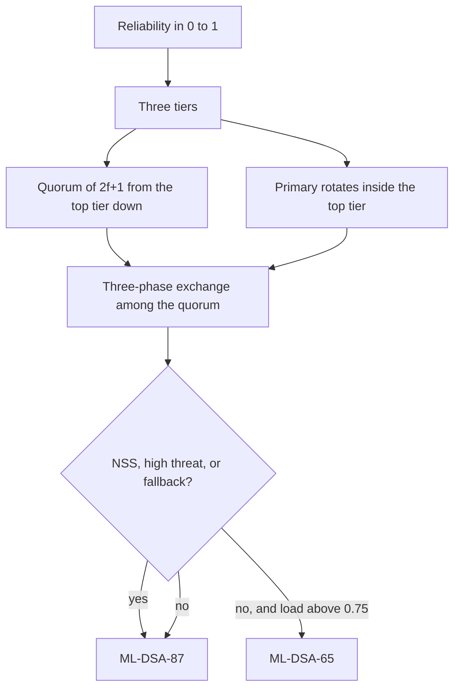

# Who speaks

```mermaid
flowchart TD
  R[Reliability in 0 to 1] --> T[Three tiers]
  T --> Q[Quorum of 2f+1 from the top tier down]
  T --> P[Primary rotates inside the top tier]
  Q --> B[Three-phase exchange among the quorum]
  P --> B
  B --> S{NSS, high threat, or fallback?}
  S -->|yes| A[ML-DSA-87]
  S -->|no, and load above 0.75| C[ML-DSA-65]
  S -->|no| A
```

Empty-block fallback is a policy input to the signature rule. It is not a simulated packet trace.
